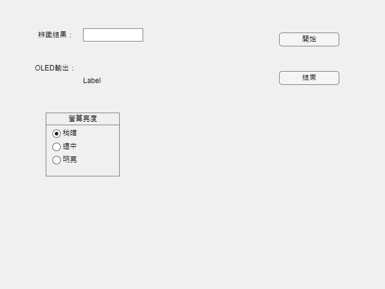

# AI HAT

AI HAT 是一套為聽損者設計的即時字幕帽原型。系統擷取環境語音，在電腦端完成語音辨識，再透過序列埠把 UTF-8 文字送到帽簷上的 SSD1322 OLED 顯示器，讓使用者以字幕輔助面對面溝通。



## 系統架構


## Repository 內容

```text
firmware/
├─ arduino_uno/       Arduino Uno 核心顯示程式
├─ esp32_serial/      ESP32 序列埠顯示版本
└─ experiments/       伺服馬達與 Bluetooth 實驗原型
matlab/
├─ apps/core/         主要 App Designer 專案（.mlapp）
├─ apps/experimental/ 語音活動與喇叭聲偵測實驗 App
├─ exported/          由 .mlapp 匯出的唯讀 MATLAB 原始碼
└─ experiments/       獨立音訊偵測實驗
docs/
├─ SETUP.md           硬體接線、安裝與啟動方式
└─ ARCHIVE.md         未納入 Git 的原始資料說明
```

## 快速開始

1. 依 [安裝與操作指南](docs/SETUP.md) 接妥 SSD1322 OLED，安裝 Arduino IDE 與 U8g2 library。
2. 依控制板選擇並燒錄：
   - Arduino Uno：`firmware/arduino_uno/AIHatDisplay/AIHatDisplay.ino`
   - ESP32：`firmware/esp32_serial/AIHatEsp32Display/AIHatEsp32Display.ino`
3. 在 MATLAB App Designer 開啟 `matlab/apps/core/app_final.mlapp`。
4. 將 App 內的 `COM3` 改成實際序列埠，確認 Windows 語音輸入可由 `F2` 啟動。
5. 執行 App，按下「開始」，辨識文字會以句點 `.` 作為訊息結束符傳給顯示器。

## 需求

- Windows（現有 GUI 以 Java `Robot` 模擬 `F2` 與 `Enter`）
- MATLAB R2023a Update 2 或更新版本
- MATLAB App Designer；實驗版另使用 Audio Toolbox 的 `detectSpeech` / `audioDeviceReader`
- Arduino IDE 或相容工具鏈
- U8g2 library
- Arduino Uno 或 ESP32、SSD1322 256×64 OLED、USB serial connection
- 伺服馬達版本另需 Servo library

## 版本狀態

- `matlab/apps/core/app_final.mlapp` 與 Arduino Uno firmware 是 2023 年完成的核心原型。
- `matlab/apps/experimental/` 是 2024 年的語音活動、喇叭聲與 YAMNet 延伸實驗，仍含固定 COM port 或本機路徑，使用前需調整。
- `firmware/experiments/esp32_bluetooth_prototype.ino` 是尚未完成的 Bluetooth 原型，不列入穩定流程。
- 目前沒有自動化硬體測試；實際執行需 MATLAB、麥克風與對應控制板。

## 資料與隱私

原始工作資料夾包含錄音、影片、訓練資料、比賽文件、第三方原始碼、執行檔與個人資料。這些內容均由白名單式 `.gitignore` 排除，只提交本 repository 列出的精簡內容。提交前仍建議執行 `git status`，確認沒有意外加入憑證、音訊或個資。

## 授權

本專案目前尚未指定開源授權。除非權利人另行授權，請勿假設可以複製、散布或商業使用。U8g2、MATLAB、YAMNet 及其他第三方元件各自適用其原始授權條款，且未將其原始碼打包進本 repository。
